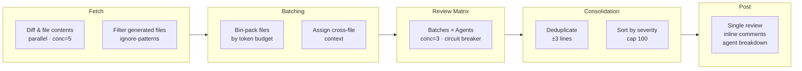

<p align="center">
  
</p>

<h1 align="center">Livvie Code Review</h1>

<p align="center">
  AI-powered code review with custom reviewer agents, native suggestion blocks, and REQUEST_CHANGES support.
</p>

<p align="center">
  <a href="https://livvie.io/">livvie.io</a> · <a href="#license">MIT</a> · <a href="#quick-start">Quick Start</a>
</p>

---

<p align="center">
  <a href="https://github.com/4itworks/livvie_code_review/actions/workflows/ci.yml"></a>
  <a href="https://github.com/marketplace/actions/livvie-code-review"></a>
</p>

---

## Quick Start

**1. Add secret**

| Secret | Value |
|--------|-------|
| `LLM_API_KEY` | Your LLM API key |

**2. Create agent files**

```bash
mkdir -p .github/livvie_code_review_agents
```

Create at least one `.md` file. Each file defines one reviewer:

```markdown
---
name: General Reviewer
---

You are a **General Code Reviewer**. Review for edge cases, correctness,
logic errors, and anything a senior developer would notice during code review.
```

**3. Add workflow**

```yaml
name: AI Code Review

on:
  pull_request:
    types: [opened, ready_for_review]
    paths:
      - "**.dart"

permissions:
  contents: read
  pull-requests: write

jobs:
  review:
    runs-on: ubuntu-latest
    steps:
      - uses: actions/checkout@v6
        with:
          fetch-depth: 0

      - uses: 4itworks/livvie_code_review@v2
        with:
          # Required
          github-token: ${{ secrets.GITHUB_TOKEN }}
          llm-api-key: ${{ secrets.LLM_API_KEY }}
          model: "z-ai/glm-5.2"

          # LLM provider (default: OpenRouter)
          llm-base-url: "https://openrouter.ai/api/v1"
          fallback-model: ""

          # Agent files (default: .github/livvie_code_review_agents)
          agents-dir: ".github/livvie_code_review_agents"

          # Project context file (shared across all agents)
          review-instructions-file: ".github/code-reviewer.md"

          # Token & context limits
          context-window: "128000"
          max-output-tokens: "16000"
          max-diff-size: "50000"
          reasoning-effort: "none"

          # Cost control
          max-batches: "0"
          max-comments: "25"

          # Review behavior
          include-severities: "low,medium,high"
          include-confidences: "low,medium,high"
          request-changes-on: "high"
          ignore-patterns: "build/**,dist/**,node_modules/**"

          # Debugging
          verbose: "false"
```

---

## Table of Contents

- [Features](#features)
- [Agent Files](#agent-files)
- [Inputs](#inputs)
- [Outputs](#outputs)
- [Cost Control](#cost-control)
- [Supported Providers](#supported-providers)
- [Architecture](#architecture)
- [Development](#development)
- [License](#license)

## Features

- **Custom reviewer agents** — define reviewers via `.md` files with YAML frontmatter. Full control over persona, focus areas, and prompts
- **Per-agent model overrides** — run different agents on different models (e.g., security on Claude, performance on GPT)
- **Suggestion blocks** — every code fix renders as an inline "Accept" button in the PR diff
- **REQUEST_CHANGES** — high-severity findings block the PR until resolved
- **APPROVE** — PRs with zero findings are approved automatically
- **Inline comments** — findings posted on the exact line in the diff
- **Deduplication** — findings from multiple agents on the same line are merged
- **Batching** — files bin-packed by token budget for large PRs without context truncation
- **Circuit breaker** — automatic fallback to a secondary model if the primary fails
- **Bring your own LLM** — works with any OpenAI-compatible API (OpenRouter, OpenAI, Groq, Ollama)
- **Stale review dismissal** — previous reviews from past runs are cleaned up automatically

## Agent Files

Each reviewer is a `.md` file in `.github/livvie_code_review_agents/`. The body becomes the agent's system prompt. Output format rules (JSON schema, severity definitions, suggestion formatting) are appended automatically — you only write the persona.

### File format

```markdown
---
name: Security Reviewer
description: Reviews code for security vulnerabilities
enabled: true
model: anthropic/claude-sonnet-4
temperature: 0.1
---

You are a **Security Reviewer**. You review code for security vulnerabilities.

## Your focus areas
- Injection: SQL injection, command injection, XSS, path traversal
- Secrets: hardcoded API keys, tokens, passwords
- Authentication: missing auth checks, privilege escalation

Only flag genuine security risks.
```

### Frontmatter fields

| Field | Required | Default | Description |
|-------|----------|---------|-------------|
| `name` | **yes** | — | Display name in PR comments. Must be unique across agents. |
| `description` | no | `""` | Short description (logged at startup). |
| `enabled` | no | `true` | Set to `false` to disable without deleting. |
| `model` | no | `null` | Override the global `model` for this agent. |
| `temperature` | no | `0.1` | LLM temperature (0–2). |

The filename is the agent's stable ID: `security.md` → `security`.

### Agent examples

<details>
<summary><b>generalist.md</b></summary>

```markdown
---
name: General Reviewer
---

You are a **General Code Reviewer**. You review code for issues that span multiple concerns and for things that specialist reviewers might miss.

## Your focus areas
- **Cross-cutting concerns**: issues that don't fit neatly into one category
- **Edge cases**: null/empty handling, boundary conditions, race conditions
- **Correctness**: logic errors, wrong variable references, incorrect conditions
- **Documentation**: missing doc comments for public APIs, misleading comments
- **Consistency**: inconsistent error handling within the same module
- **Testing**: obviously untested code paths, testability issues

Flag anything that a thorough senior developer would notice during a code review.
```
</details>

<details>
<summary><b>security.md</b></summary>

```markdown
---
name: Security Reviewer
---

You are a **Security Reviewer**. You review code for security vulnerabilities and risks.

## Your focus areas
- **Injection**: SQL injection, command injection, XSS, template injection, path traversal
- **Secrets**: hardcoded API keys, tokens, passwords, secrets in logs or error messages
- **Authentication/Authorization**: missing auth checks, privilege escalation, insecure token handling
- **Input validation**: missing sanitization, trusting user input, unsafe deserialization
- **Crypto**: weak hashing, insecure random, hardcoded IVs
- **Data exposure**: sensitive data in logs, error messages, or URLs

Only flag genuine security risks.
```
</details>

<details>
<summary><b>performance.md</b></summary>

```markdown
---
name: Performance Reviewer
---

You are a **Performance Reviewer**. You review code for performance issues and inefficiencies.

## Your focus areas
- **Database**: N+1 queries, missing indexes, unnecessary queries in loops
- **Memory**: memory leaks, unnecessary allocations, unbounded caches
- **Rebuilds**: unnecessary widget rebuilds, redundant computations
- **Algorithmic complexity**: O(n²) where O(n) is possible, early-exit opportunities
- **Resource management**: unclosed streams/connections/controllers, missing dispose
- **Async**: unnecessary awaiting in loops, blocking async operations

Only flag performance issues that would have a real impact.
```
</details>

<details>
<summary><b>architecture.md</b></summary>

```markdown
---
name: Architecture Reviewer
---

You are an **Architecture Reviewer**. You review code for architectural soundness.

## Your focus areas
- **Separation of concerns**: business logic in UI, mixed responsibilities
- **Coupling**: tight coupling, circular dependencies
- **Layering**: violations of layer boundaries
- **SOLID**: single responsibility violations, interface segregation
- **Abstraction**: missing abstractions, over-abstraction (YAGNI)

Only flag architectural issues that would cause real maintenance problems.
```
</details>

<details>
<summary><b>code-quality.md</b></summary>

```markdown
---
name: Code Quality Reviewer
---

You are a **Code Quality Reviewer**. You review code for quality, readability, and maintainability.

## Your focus areas
- **Readability**: unclear variable names, cryptic abbreviations
- **Dead code**: unused imports, unreachable branches, commented-out code
- **Complexity**: overly nested conditionals, functions too long
- **DRY violations**: duplicated logic that should be extracted
- **Error handling**: swallowed exceptions, missing error context
- **Naming**: inconsistent naming conventions

Only flag issues that genuinely harm code quality.
```
</details>

### Agent files vs review instructions

| | Agent `.md` file | `review-instructions-file` |
|---|---|---|
| **Purpose** | Reviewer persona + focus areas | Project context + conventions |
| **Injected into** | System prompt (per agent) | User message (all agents) |
| **Example** | "You are a Security Reviewer. Focus on injection, secrets..." | "This is a Flutter monorepo with BLoC, using mocktail for tests." |
| **Scope** | One per reviewer | Shared across all reviewers |

Use `review-instructions-file` (default: `.github/code-reviewer.md`) for project context that every agent needs. Use agent `.md` files for reviewer-specific focus and persona.

## Inputs

| Input | Required | Default | Description |
|-------|----------|---------|-------------|
| `github-token` | yes | `${{ github.token }}` | GitHub token |
| `llm-api-key` | yes | — | LLM API key (store as Secret) |
| `llm-base-url` | no | `https://openrouter.ai/api/v1` | OpenAI-compatible base URL |
| `model` | yes | — | Model name (e.g. `z-ai/glm-5.2`) |
| `agents-dir` | no | `.github/livvie_code_review_agents` | Directory containing agent `.md` files |
| `review-instructions-file` | no | `.github/code-reviewer.md` | Project context file shared across all agents |
| `max-diff-size` | no | `50000` | Max diff chars per file |
| `max-output-tokens` | no | `16000` | Max response tokens |
| `reasoning-effort` | no | `none` | Reasoning effort (none, low, medium, high, max) |
| `fallback-model` | no | `""` | Fallback model if primary fails |
| `fallback-model` | no | `""` | Fallback model if primary fails |
| `include-severities` | no | `low,medium,high` | Comma-separated severities to include in the review |
| `include-confidences` | no | `low,medium,high` | Comma-separated confidences to include in the review |
| `request-changes-on` | no | `high` | Comma-separated severities that trigger `REQUEST_CHANGES` |
| `max-comments` | no | `25` | Max inline comments per review |
| `ignore-patterns` | no | `build/**,dist/**,node_modules/**` | Glob patterns for files to skip |
| `max-batches` | no | `0` | Max batches (0 = unlimited). LLM calls = batches × agents |
| `context-window` | no | `128000` | Model context window in tokens |
| `verbose` | no | `false` | Log LLM reasoning traces to Actions log |

Only `llm-api-key` needs to be a GitHub Secret. The `model` and `llm-base-url` are plain strings.

## Outputs

| Output | Description |
|--------|-------------|
| `review-id` | The ID of the posted GitHub review |
| `finding-count` | Total number of findings in the review |

## Cost Control

Two levers control cost:

- **Number of agent files** — each `.md` file = 1 LLM call per batch. One agent is the cheapest; five agents give broader coverage at 5× the cost.
- **`max-batches`** — caps file batches. Total LLM calls = `min(batches, max-batches) × num_agents`.

**Example:** `max-batches: "3"` + 2 agent files = at most 6 LLM calls regardless of PR size.

## Supported Providers

Any OpenAI-compatible API works out of the box:

| Provider | `llm-base-url` | Notes |
|----------|---------------|-------|
| OpenRouter | `https://openrouter.ai/api/v1` | Default — access all major models with one key |
| OpenAI | `https://api.openai.com/v1` | Direct OpenAI API |
| Groq | `https://api.groq.com/openai/v1` | Fast inference |
| Ollama | `http://localhost:11434/v1` | Local models, self-hosted |

## Architecture



**Pipeline stages:**

1. **Fetch** — diff and file contents fetched in parallel (concurrency 5), generated files filtered via `ignore-patterns`
2. **Batching** — files bin-packed into batches by token budget, with cross-file context per batch
3. **Review** — each batch × each agent = one LLM call (concurrency 3, circuit breaker with optional fallback model)
4. **Consolidation** — findings deduplicated (same file + ±3 lines = merged), sorted by severity, capped at 100
5. **Post** — single consolidated review with inline comments, agent breakdown table, and pipeline stats

The review event (`REQUEST_CHANGES`, `COMMENT`, or `APPROVE`) is determined by the `request-changes-on` input. Any finding whose severity is in that list causes the review to become `REQUEST_CHANGES`. PRs with no findings at all receive `APPROVE`.

`include-severities` and `include-confidences` filter which findings are included in the review. For example:

```yaml
include-confidences: "high"
request-changes-on: "high,medium"
```

This posts only high-confidence findings and requests changes when any high or medium severity finding is present. Stale reviews from previous runs are dismissed automatically.

## Development

```bash
npm ci                      # Install dependencies
npm test                    # Run tests (vitest)
npm run test:coverage       # Run tests with coverage report
npm run typecheck           # Type check (tsc --noEmit)
npm run format              # Format code (prettier)
npm run format:check        # Check formatting (CI)
npm run build               # Build dist/index.js (ncc)
```

## License

MIT