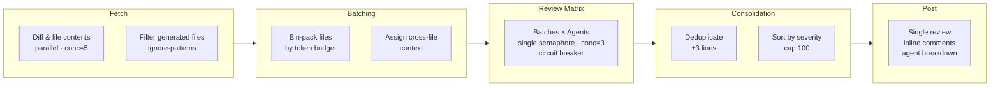

<p align="center">
  
</p>

<h1 align="center">Livvie Code Review</h1>

<p align="center">
  AI-powered GitHub Action with user-defined review agents, native suggestion blocks, and REQUEST_CHANGES support.
</p>

<p align="center">
  <a href="https://livvie.io/">livvie.io</a> · <a href="#license">MIT</a> · <a href="#setup">Quick Start</a>
</p>

---

<p align="center"><a href="https://github.com/4itworks/livvie_code_review/actions/workflows/ci.yml"></a> <a href="https://github.com/marketplace/actions/livvie-code-review"></a> </p>

---

## Table of Contents

- [Why](#why)
- [Features](#features)
- [Architecture](#architecture)
- [Agent Files](#agent-files)
- [Setup](#setup)
- [Inputs](#inputs)
- [Outputs](#outputs)
- [Cost Control](#cost-control)
- [Supported Providers](#supported-providers)
- [Migrating from v1](#migrating-from-v1)
- [Development](#development)
- [Branch Protection](#branch-protection)
- [License](#license)

## Why

Most AI code review tools post code fixes as generic code blocks. Livvie Code Review posts every fix as a GitHub `suggestion` block — developers apply fixes with one click, no copy-paste. Built by [Livvie](https://livvie.io/) to keep code quality high without slowing down PRs.

## Features

- **User-defined review agents** — define custom reviewers via `.md` files in your repo. Each file = one specialist with its own prompt, model, and temperature
- **Full prompt control** — you write the persona, the action handles output format, severity rules, and suggestion blocks automatically
- **Per-agent model overrides** — run different agents on different models (e.g., security on Claude, performance on GPT)
- **Batching for large PRs** — files are bin-packed by token budget, so even 100-file PRs get reviewed without context truncation
- **Suggestion blocks** — every code fix renders as an inline "Accept" button in the PR diff
- **REQUEST_CHANGES** — high-severity findings block the PR until resolved (configurable via `request-changes-on-high`)
- **APPROVE** — PRs with zero findings are approved automatically
- **Inline comments** — findings are posted on the exact line in the diff, not in the review body
- **Agent attribution** — each finding shows which reviewer found it
- **Deduplication** — findings from multiple agents on the same line are merged
- **Circuit breaker** — automatically falls back to a secondary model if the primary fails
- **Bring your own LLM** — works with OpenRouter, OpenAI, Groq, Ollama, or any OpenAI-compatible API
- **Cost control** — `max-batches` caps total LLM calls; the number of agent files controls how many reviewers run
- **Stale review dismissal** — previous reviews from past runs are dismissed automatically

## Architecture



**Pipeline stages:**

1. **Fetch** — diff and file contents fetched in parallel (concurrency 5), generated files filtered out via `ignore-patterns`
2. **Batching** — files bin-packed into batches by token budget, with cross-file context assigned per batch
3. **Review** — each batch × each agent = one LLM call (concurrency 3, circuit breaker protected with optional fallback model). Per-agent model and temperature overrides are applied
4. **Consolidation** — findings deduplicated (same file + ±3 lines = merged, keeping highest confidence), sorted by severity, capped at 100
5. **Post** — single consolidated review with inline comments, agent breakdown table, and pipeline stats

### Cost model

```
Total LLM calls = num_batches × num_agents
```

| PR Size | Files | Batches | Calls (5 agents) |
|---------|-------|---------|-------------------|
| Small   | 5     | 1       | 5                 |
| Medium  | 20    | 3       | 15                |
| Large   | 50    | 8       | 40                |

With `max-batches=5` and 1 agent: always ≤ 5 calls. See [Cost Control](#cost-control) for details.

If any finding is high-severity, the review event is `REQUEST_CHANGES`; otherwise `COMMENT`. Stale reviews from previous runs are dismissed automatically.

## Agent Files

Each review agent is defined as a `.md` file in `.github/livvie_code_review_agents/`. The markdown body becomes the agent's system prompt — you write the persona and focus areas, and the action automatically appends the output format rules (JSON schema, severity definitions, suggestion formatting).

### File format

```markdown
---
name: Security Reviewer
description: Reviews code for security vulnerabilities and risks
enabled: true
model: null
temperature: 0.1
---

You are a **Security Reviewer**. You review code for security vulnerabilities.

## Your focus areas
- Injection: SQL injection, command injection, XSS, path traversal
- Secrets: hardcoded API keys, tokens, passwords
- Authentication: missing auth checks, privilege escalation
- Input validation: missing sanitization, unsafe deserialization

Only flag genuine security risks.
```

### Frontmatter fields

| Field | Required | Default | Description |
|-------|----------|---------|-------------|
| `name` | **yes** | — | Human-readable name shown in PR comments. Must be unique across agents. |
| `description` | no | `""` | Short description (logged at startup). |
| `enabled` | no | `true` | Set to `false` to disable an agent without deleting the file. |
| `model` | no | `null` | Override the global `model` for this agent only. |
| `temperature` | no | `0.1` | LLM temperature override (0–2). |

The filename is the agent's stable ID: `security.md` → `security`.

### Minimal agent file

```markdown
---
name: General Reviewer
---

You are a **General Code Reviewer**. Review for edge cases, correctness, and anything a senior developer would notice.
```

### Built-in examples

Here are the 5 agents matching the v1 defaults. Create them in `.github/livvie_code_review_agents/`:

<details>
<summary><b>generalist.md</b></summary>

```markdown
---
name: General Reviewer
---

You are a **General Code Reviewer**. You review code for issues that span multiple concerns and for things that specialist reviewers might miss.

## Your focus areas
- **Cross-cutting concerns**: issues that don't fit neatly into one category
- **Edge cases**: null/empty handling, boundary conditions, race conditions, off-by-one errors
- **Correctness**: logic errors, wrong variable references, incorrect conditions
- **Documentation**: missing doc comments for public APIs, misleading comments
- **Consistency**: inconsistent error handling within the same module, inconsistent patterns
- **Testing**: obviously untested code paths, testability issues

Flag anything that a thorough senior developer would notice during a code review.
```
</details>

<details>
<summary><b>security.md</b></summary>

```markdown
---
name: Security Reviewer
---

You are a **Security Reviewer**. You review code for security vulnerabilities and risks.

## Your focus areas
- **Injection**: SQL injection, command injection, XSS, template injection, path traversal
- **Secrets**: hardcoded API keys, tokens, passwords, secrets in logs or error messages
- **Authentication/Authorization**: missing auth checks, privilege escalation, insecure token handling
- **Input validation**: missing sanitization, trusting user input, unsafe deserialization
- **Crypto**: weak hashing, insecure random, hardcoded IVs, ECB mode
- **Data exposure**: sensitive data in logs, error messages, or URLs
- **Dependencies**: known-vulnerable patterns, unsafe API usage

Only flag genuine security risks. Don't flag theoretical issues that require specific attack conditions unless the attack vector is realistic for this code's context.
```
</details>

<details>
<summary><b>performance.md</b></summary>

```markdown
---
name: Performance Reviewer
---

You are a **Performance Reviewer**. You review code for performance issues and inefficiencies.

## Your focus areas
- **Database**: N+1 queries, missing indexes, unnecessary queries in loops
- **Memory**: memory leaks, unnecessary allocations in hot paths, unbounded caches/growth
- **Rebuilds**: unnecessary widget rebuilds (Flutter), unnecessary re-renders (React), redundant computations
- **Algorithmic complexity**: O(n²) where O(n) is possible, redundant iterations, early-exit opportunities
- **Resource management**: unclosed streams/connections/controllers, missing dispose/cleanup
- **Caching**: missing cache opportunities, cache invalidation issues
- **Async**: unnecessary awaiting in loops (should use Future.wait), blocking async operations

Only flag performance issues that would have a real impact. Don't flag micro-optimizations that don't matter in practice.
```
</details>

<details>
<summary><b>architecture.md</b></summary>

```markdown
---
name: Architecture Reviewer
---

You are an **Architecture Reviewer**. You review code for architectural soundness and design quality.

## Your focus areas
- **Separation of concerns**: business logic in UI, UI concerns in data layer, mixed responsibilities
- **Coupling**: tight coupling between modules, circular dependencies, unnecessary dependencies
- **Layering**: violations of layer boundaries (e.g., UI directly accessing database)
- **Dependency direction**: dependencies flowing in the wrong direction (e.g., domain depending on UI)
- **SOLID**: single responsibility violations, open/closed principle issues, interface segregation
- **Abstraction**: missing abstractions (primitive obsession), over-abstraction (YAGNI violations)
- **Design patterns**: missing pattern where it would significantly help, anti-patterns

Only flag architectural issues that would cause real maintenance problems. Don't suggest speculative abstractions or patterns "just in case."
```
</details>

<details>
<summary><b>code-quality.md</b></summary>

```markdown
---
name: Code Quality Reviewer
---

You are a **Code Quality Reviewer**. You review code for quality, readability, and maintainability.

## Your focus areas
- **Readability**: unclear variable names, cryptic abbreviations, misleading function names
- **Dead code**: unused imports, unreachable branches, commented-out code
- **Complexity**: overly nested conditionals, functions too long to understand, excessive parameter lists
- **DRY violations**: duplicated logic that should be extracted
- **Error handling**: swallowed exceptions, missing error context, catch-all handlers
- **Naming**: inconsistent naming conventions, names that don't describe what they do

Only flag issues that genuinely harm code quality. Don't nitpick style that matches existing patterns in the file.
```
</details>

### Custom agents

The power of v2: create domain-specific reviewers tailored to your project.

```markdown
---
name: Flutter Widget Reviewer
description: Specialized reviewer for Flutter widget tree issues
model: anthropic/claude-sonnet-4
temperature: 0.2
---

You are a **Flutter Widget Reviewer** specializing in widget tree correctness.

## Your focus areas
- Unnecessary rebuilds: widgets that rebuild when they shouldn't
- Missing const constructors
- Incorrect use of StatefulWidget vs StatelessWidget
- Key usage: missing keys in lists, wrong key types
- BuildContext misuse: using context after async gaps
```

## Setup

### 1. Add secret

Only the API key needs to be a secret:

| Secret | Value |
|--------|-------|
| `LLM_API_KEY` | Your LLM API key |

### 2. Create agent files

Create `.github/livvie_code_review_agents/` with at least one `.md` file:

```bash
mkdir -p .github/livvie_code_review_agents
```

Add your agents (see [Agent Files](#agent-files) for format and examples).

### 3. Add workflow

```yaml
name: AI Code Review

on:
  pull_request:
    types: [opened, ready_for_review]
    paths:
      - "**.dart"

permissions:
  contents: read
  pull-requests: write
jobs:
  review:
    runs-on: ubuntu-latest
    steps:
      - uses: actions/checkout@v6
        with:
          fetch-depth: 0
      - uses: 4itworks/livvie_code_review@v2
        with:
          github-token: ${{ secrets.GITHUB_TOKEN }}
          llm-api-key: ${{ secrets.LLM_API_KEY }}
          llm-base-url: "https://openrouter.ai/api/v1"
          model: "z-ai/glm-5.2"
          review-instructions-file: ".github/code-reviewer.md"
          max-batches: "0"
          context-window: "128000"
          ignore-patterns: "build/**,dist/**,node_modules/**"
```

### 4. Add review instructions (optional)

Create `.github/code-reviewer.md` in your repo with project-specific context (tech stack, coding standards, conventions). This is orthogonal to agent files — agents define *how* to review, instructions define *what the project is*.

## Inputs

| Input | Required | Default | Description |
|-------|----------|---------|-------------|
| `github-token` | yes | `${{ github.token }}` | GitHub token |
| `llm-api-key` | yes | — | LLM API key (secret) |
| `llm-base-url` | no | `https://openrouter.ai/api/v1` | OpenAI-compatible base URL (plain string) |
| `model` | yes | — | Model name (plain string, e.g. `z-ai/glm-5.2`) |
| `agents-dir` | no | `.github/livvie_code_review_agents` | Directory containing agent `.md` files |
| `review-instructions-file` | no | `.github/code-reviewer.md` | Extra review instructions |
| `max-diff-size` | no | `50000` | Max diff chars per file |
| `max-output-tokens` | no | `16000` | Max response tokens |
| `reasoning-effort` | no | `none` | Reasoning effort (none, low, medium, high, max) |
| `fallback-model` | no | `""` | Fallback model if primary fails |
| `request-changes-on-high` | no | `true` | Block PR on high-severity |
| `max-comments` | no | `25` | Max inline comments |
| `ignore-patterns` | no | `build/**,dist/**,node_modules/**` | Glob patterns for files to skip |
| `max-batches` | no | `0` | Max batches (caps LLM calls = batches × agents). 0 = unlimited |
| `context-window` | no | `128000` | Model context window in tokens (for budget calculation) |
| `verbose` | no | `false` | Log LLM reasoning traces and debug info to the Actions log |

Only `llm-api-key` needs to be a GitHub Secret. The `model` and `llm-base-url` are plain strings — they are not sensitive values and can be set directly in the workflow.

## Outputs

| Output | Description |
|--------|-------------|
| `review-id` | The ID of the posted GitHub review |
| `finding-count` | Total number of findings in the review |

## Cost Control

The two primary cost control levers:

- **Agent files** — the number of `.md` files in your agents directory controls how many reviewers run. One agent = 1 call per batch. Five agents = 5× the cost.
- **`max-batches`** — caps the number of file batches. Total LLM calls = `min(batches, max-batches) × num_agents`. Set `max-batches: "5"` to cap costs on large PRs.

**Example:** `max-batches: "3"` + 2 agent files = at most 6 LLM calls regardless of PR size.

## Supported Providers

Any OpenAI-compatible API works out of the box:

| Provider | `llm-base-url` | Notes |
|----------|---------------|-------|
| OpenRouter | `https://openrouter.ai/api/v1` | Default — access all major models with one key |
| OpenAI | `https://api.openai.com/v1` | Direct OpenAI API |
| Groq | `https://api.groq.com/openai/v1` | Fast inference for cheaper models |
| Ollama | `http://localhost:11434/v1` | Local models, self-hosted |

## Migrating from v1

v2 replaces the hardcoded `perspectives` input with user-defined agent `.md` files. The `perspectives` input has been removed.

### Zero-effort migration

If you used the default `perspectives: "generalist"`:

```yaml
# Before (v1)
- uses: 4itworks/livvie_code_review@v1

# After (v2) — create .github/livvie_code_review_agents/generalist.md
- uses: 4itworks/livvie_code_review@v2
```

Copy the [generalist.md example](#agent-files) into your repo. Done.

### Migrating custom perspectives

If you used `perspectives: "security,performance"`:

1. Create `.github/livvie_code_review_agents/`
2. Add `security.md` and `performance.md` (copy from the [built-in examples](#built-in-examples) above)
3. Remove the `perspectives` line from your workflow
4. Update the tag: `@v1` → `@v2`

### What changed

| v1 | v2 |
|----|----|
| `perspectives: "security,performance"` input | Agent `.md` files in `.github/livvie_code_review_agents/` |
| 5 hardcoded prompts | Unlimited custom prompts |
| Same model for all agents | Per-agent model/temperature overrides |
| `@v1` tag | `@v2` tag |

### v1 still works

The `v1` tag is frozen. Existing workflows using `@v1` continue to work indefinitely. v2 is a separate tag — upgrading is opt-in.

## Development

```bash
npm ci                      # Install dependencies
npm test                    # Run tests (vitest)
npm run test:coverage       # Run tests with coverage report
npm run typecheck           # Type check (tsc --noEmit)
npm run format              # Format code (prettier)
npm run format:check        # Check formatting (CI)
npm run build               # Build dist/index.js (ncc)
```

### Pre-commit checklist

Before pushing, run:

```bash
npm run format && npm run typecheck && npm test && npm run build
```

CI runs `lint`, `typecheck`, `test`, and `build-check` in parallel — all must pass before merge.

## Branch Protection

To require CI checks before merging PRs, enable branch protection on `main`:

1. Go to **Settings → Branches → Add rule**
2. Set **Branch name pattern** to `main`
3. Enable **Require status checks to pass before merging**
4. Select these required checks: `format`, `lint`, `typecheck`, `test`, `build-check`
5. Enable **Require branches to be up to date before merging**

This ensures every PR passes formatting, typecheck, tests, and build verification before merge.

## License

MIT
