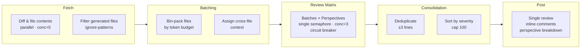

<p align="center">
  
</p>

<h1 align="center">Livvie Code Review</h1>

<p align="center">
  AI-powered GitHub Action with multi-perspective specialist reviewers, native suggestion blocks, and REQUEST_CHANGES support.
</p>

<p align="center">
  <a href="https://livvie.io/">livvie.io</a> · <a href="#license">MIT</a> · <a href="#setup">Quick Start</a>
</p>

<p align="center">
  <a href="https://github.com/4itworks/livvie_code_review/actions/workflows/ci.yml"></a>
  <a href="https://github.com/marketplace/actions/livvie-code-review"></a>
  
</p>

---

## Table of Contents

- [Why](#why)
- [Features](#features)
- [Architecture](#architecture)
- [Review Perspectives](#review-perspectives)
- [Setup](#setup)
- [Inputs](#inputs)
- [Cost Control](#cost-control)
- [Supported Providers](#supported-providers)
- [License](#license)

## Why

Most AI code review tools post code fixes as generic code blocks. Livvie Code Review posts every fix as a GitHub `suggestion` block — developers apply fixes with one click, no copy-paste. Built by [Livvie](https://livvie.io/) to keep code quality high without slowing down PRs.

## Features

- **Multi-perspective specialist reviewers** — choose from 5 specialized review angles: code-quality, security, performance, architecture, and generalist
- **Batching for large PRs** — files are bin-packed by token budget, so even 100-file PRs get reviewed without context truncation
- **Suggestion blocks** — every code fix renders as an inline "Accept" button in the PR diff
- **REQUEST_CHANGES** — high-severity findings block the PR until resolved (configurable via `request-changes-on-high`)
- **APPROVE** — PRs with zero findings are approved automatically
- **Inline comments** — findings are posted on the exact line in the diff, not in the review body
- **Perspective attribution** — each finding shows which specialist reviewer found it
- **Deduplication** — findings from multiple perspectives on the same line are merged
- **Circuit breaker** — automatically falls back to a secondary model if the primary fails
- **Bring your own LLM** — works with OpenRouter, OpenAI, Groq, Ollama, or any OpenAI-compatible API
- **Cost control** — `max-batches` caps total LLM calls; `perspectives` controls how many reviewers run
- **Stale review dismissal** — previous reviews from past runs are dismissed automatically

## Architecture



**Pipeline stages:**

1. **Fetch** — diff and file contents fetched in parallel (concurrency 5), generated files filtered out via `ignore-patterns`
2. **Batching** — files bin-packed into batches by token budget, with cross-file context assigned per batch
3. **Review** — each batch × each perspective = one LLM call (concurrency 3, circuit breaker protected with optional fallback model)
4. **Consolidation** — findings deduplicated (same file + ±3 lines = merged, keeping highest confidence), sorted by severity, capped at 100
5. **Post** — single consolidated review with inline comments, perspective breakdown table, and pipeline stats

### Cost model

```
Total LLM calls = num_batches × num_perspectives
```

| PR Size | Files | Batches | Calls (5 perspectives) |
|--------|-------|---------|------------------------|
| Small  | 5     | 1       | 5                      |
| Medium | 20    | 3       | 15                     |
| Large  | 50    | 8       | 40                     |

With `max-batches=5` and 1 perspective: always ≤ 5 calls. See [Cost Control](#cost-control) for details.

If any finding is high-severity, the review event is `REQUEST_CHANGES`; otherwise `COMMENT`. Stale reviews from previous runs are dismissed automatically.

## Review Perspectives

Five specialist reviewers are available. By default, only `generalist` runs to keep costs low. Add more perspectives for thorough multi-angle reviews.

| Perspective | ID | Focus |
|-------------|----|-------|
| Code Quality Reviewer | `code-quality` | Readability, naming, dead code, complexity, DRY, error handling |
| Security Reviewer | `security` | Injection risks, secret leaks, auth bypass, input validation, crypto |
| Performance Reviewer | `performance` | N+1 queries, memory leaks, unnecessary rebuilds, algorithmic complexity |
| Architecture Reviewer | `architecture` | Separation of concerns, coupling, layering, SOLID, design patterns |
| General Reviewer | `generalist` | Cross-cutting concerns, edge cases, correctness, documentation, consistency |

### Perspective examples

Run all five specialists for a thorough review:
```yaml
perspectives: "code-quality,security,performance,architecture,generalist"
```

Run only security review for a security-focused repo:
```yaml
perspectives: "security"
```

Run code-quality + performance for a balanced but cost-conscious review:
```yaml
perspectives: "code-quality,performance"
```

## Setup

### 1. Add secret

Only the API key needs to be a secret:

| Secret | Value |
|--------|-------|
| `LLM_API_KEY` | Your LLM API key |

### 2. Add workflow

```yaml
name: AI Code Review

on:
  pull_request:
    types: [opened, ready_for_review]
    paths:
      - "**.dart"

permissions:
  contents: read
  pull-requests: write
jobs:
  review:
    runs-on: ubuntu-latest
    steps:
      - uses: actions/checkout@v6
        with:
          fetch-depth: 0
      - uses: 4itworks/livvie_code_review@v1
        with:
          github-token: ${{ secrets.GITHUB_TOKEN }}
          llm-api-key: ${{ secrets.LLM_API_KEY }}
          llm-base-url: "https://openrouter.ai/api/v1"
          model: "z-ai/glm-5.2"
          review-instructions-file: ".github/code-reviewer.md"
          perspectives: "generalist"
          max-batches: "0"
          context-window: "128000"
          ignore-patterns: "build/**,dist/**,node_modules/**"
```

### 3. Add review instructions (optional)

Create `.github/code-reviewer.md` in your repo with project-specific review rules.

## Inputs

| Input | Required | Default | Description |
|-------|----------|---------|-------------|
| `github-token` | yes | `${{ github.token }}` | GitHub token |
| `llm-api-key` | yes | — | LLM API key (secret) |
| `llm-base-url` | no | `https://openrouter.ai/api/v1` | OpenAI-compatible base URL (plain string) |
| `model` | yes | — | Model name (plain string, e.g. `z-ai/glm-5.2`) |
| `review-instructions-file` | no | `.github/code-reviewer.md` | Extra review instructions |
| `max-diff-size` | no | `50000` | Max diff chars per file |
| `max-output-tokens` | no | `16000` | Max response tokens |
| `reasoning-effort` | no | `none` | Reasoning effort (none, low, medium, high, max) |
| `fallback-model` | no | `""` | Fallback model if primary fails |
| `request-changes-on-high` | no | `true` | Block PR on high-severity |
| `max-comments` | no | `25` | Max inline comments |
| `ignore-patterns` | no | `build/**,dist/**,node_modules/**` | Glob patterns for files to skip |
| `max-batches` | no | `0` | Max batches (caps LLM calls = batches × perspectives). 0 = unlimited |
| `context-window` | no | `128000` | Model context window in tokens (for budget calculation) |
| `perspectives` | no | `generalist` | Comma-separated review perspectives to run |
| `verbose` | no | `false` | Log LLM reasoning traces and debug info to the Actions log |

Only `llm-api-key` needs to be a GitHub Secret. The `model` and `llm-base-url` are plain strings — they are not sensitive values and can be set directly in the workflow.

## Outputs

| Output | Description |
|--------|-------------|
| `review-id` | The ID of the posted GitHub review |
| `finding-count` | Total number of findings in the review |

## Cost Control

The two primary cost control levers:

- **`perspectives`** — controls how many specialist reviewers run. Default is `generalist` (1 call per batch). Adding all 5 perspectives multiplies cost by 5×.
- **`max-batches`** — caps the number of file batches. Total LLM calls = `min(batches, max-batches) × len(perspectives)`. Set `max-batches: "5"` to cap costs on large PRs.

**Example:** `max-batches: "3"` + `perspectives: "security,generalist"` = at most 6 LLM calls regardless of PR size.

## Supported Providers

Any OpenAI-compatible API works out of the box:

| Provider | `llm-base-url` | Notes |
|----------|---------------|-------|
| OpenRouter | `https://openrouter.ai/api/v1` | Default — access all major models with one key |
| OpenAI | `https://api.openai.com/v1` | Direct OpenAI API |
| Groq | `https://api.groq.com/openai/v1` | Fast inference for cheaper models |
| Ollama | `http://localhost:11434/v1` | Local models, self-hosted |

## Branch Protection

To require CI checks before merging PRs, enable branch protection on `main`:

1. Go to **Settings → Branches → Add rule**
2. Set **Branch name pattern** to `main`
3. Enable **Require status checks to pass before merging**
4. Select these required checks: `typecheck`, `test`, `build-check`
5. Enable **Require branches to be up to date before merging**

This ensures every PR passes typecheck, tests, and build verification before merge. The `self-test` (LLM smoke) job is informational only — it doesn't block merges since it requires an API key.

## License

MIT
